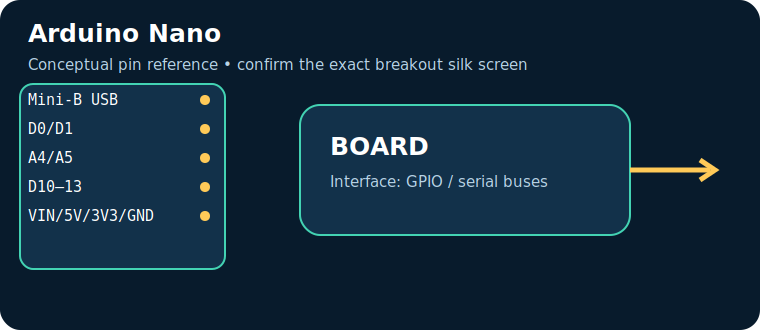
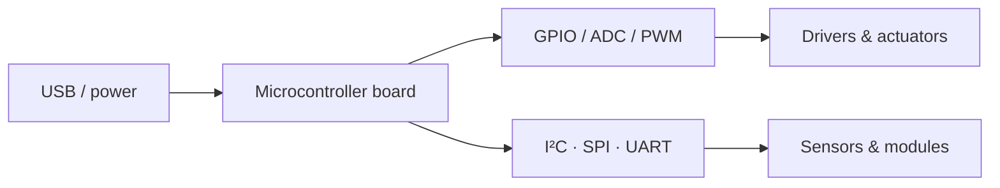

# Arduino Nano

> **Role:** compact breadboard ATmega projects. Typical Indian retail range: **₹350–1,200** (indicative on 17 July 2026, not a live quote).

| Property | Reference |
|---|---|
| Controller | ATmega328P, 16 MHz, 5 V |
| I/O summary | 14 digital I/O (6 PWM), 8 analog inputs |
| Logic level | Check the board documentation; many pins are 3.3 V-only |
| Alternative | Uno / Pro Mini |

## Reference pinout — key pins and connectors

> These labels and functions are for the named reference board revision. Header position and alternate functions must be checked against the official board pinout linked below; do not transfer Arduino-style labels between different board families.

| Pin / connector | Use |
|---|---|
| `Mini-B USB` | programming |
| `D0/D1` | UART |
| `A4/A5` | I²C |
| `D10–13` | SPI |
| `VIN/5V/3V3/GND` | power |

## Applications, technique and selection

The board executes firmware stored in its controller and uses digital/analog peripherals to sample sensors and drive outputs. Choose it for **compact breadboard ATmega projects**: its processor, voltage domain, memory, connectivity and physical size determine whether it fits. Typical applications include data loggers, control panels, robotics and connected sensor nodes.

## Three first programs, output and inference

1. [Blink / GPIO smoke test](../PROGRAM_COOKBOOK.md#blink-gpio-smoke-test): LED changes every second — proves upload, clock and output pin.
2. [I²C scanner](../PROGRAM_COOKBOOK.md#i2c-scanner): serial output lists responding addresses — proves shared-bus wiring.
3. [Filtered telemetry and alarm](../PROGRAM_COOKBOOK.md#filtered-telemetry-and-alarm): serial readings and state — proves the acquisition-to-decision loop.

**Inference:** passing these tests does not establish voltage compatibility or sensor accuracy. Confirm common ground, logic levels, current budget and exact pin multiplexing before expansion.

## Comparison and trade-offs

| Board | Best when | Trade-off |
|---|---|---|
| **Arduino Nano** | compact breadboard ATmega projects | Check its exact variant, USB interface and voltage limits |
| **Uno / Pro Mini** | requirements differ in wireless capability, speed, I/O or power | requires a different toolchain or wiring plan |

**Advantages:** popular tools/tutorials; flexible interfaces; fast iteration.

**Disadvantages:** development boards are not automatically rugged, low-power or electrically protected products; add regulator, protection, enclosure and driver circuitry where needed.

## Verification source

- Official documentation: [docs.arduino.cc](https://docs.arduino.cc/hardware/nano/)
- [Reference policy](../REFERENCE_POLICY.md)
