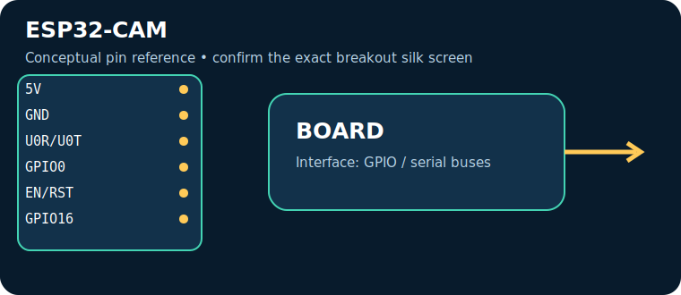
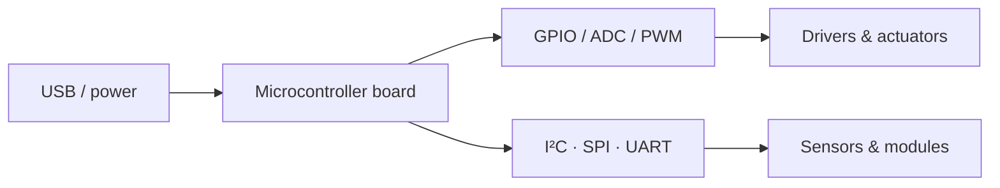

# ESP32-CAM

> **Role:** low-cost Wi‑Fi camera and vision prototypes. Typical Indian retail range: **₹550–1,200** (indicative on 17 July 2026, not a live quote).

| Property | Reference |
|---|---|
| Controller | ESP32 + OV2640 camera + Wi‑Fi, 3.3 V logic |
| I/O summary | Limited exposed GPIO, camera, microSD interface |
| Logic level | Check the board documentation; many pins are 3.3 V-only |
| Alternative | ESP32 DevKit + camera / Raspberry Pi |

## Reference pinout — key pins and connectors

> These labels and functions are for the named reference board revision. Header position and alternate functions must be checked against the official board pinout linked below; do not transfer Arduino-style labels between different board families.

| Pin / connector | Use |
|---|---|
| `5V` | module input |
| `GND` | return |
| `U0R/U0T` | serial upload |
| `GPIO0` | hold low at reset to flash |
| `EN/RST` | reset |
| `GPIO16` | commonly flash LED |
| `camera and SD consume GPIO—follow AI-Thinker pin map` | See board documentation |

## Applications, technique and selection

The board executes firmware stored in its controller and uses digital/analog peripherals to sample sensors and drive outputs. Choose it for **low-cost Wi‑Fi camera and vision prototypes**: its processor, voltage domain, memory, connectivity and physical size determine whether it fits. Typical applications include data loggers, control panels, robotics and connected sensor nodes.

## Three first programs, output and inference

1. [Blink / GPIO smoke test](../PROGRAM_COOKBOOK.md#blink-gpio-smoke-test): LED changes every second — proves upload, clock and output pin.
2. [I²C scanner](../PROGRAM_COOKBOOK.md#i2c-scanner): serial output lists responding addresses — proves shared-bus wiring.
3. [Filtered telemetry and alarm](../PROGRAM_COOKBOOK.md#filtered-telemetry-and-alarm): serial readings and state — proves the acquisition-to-decision loop.

**Inference:** passing these tests does not establish voltage compatibility or sensor accuracy. Confirm common ground, logic levels, current budget and exact pin multiplexing before expansion.

## Comparison and trade-offs

| Board | Best when | Trade-off |
|---|---|---|
| **ESP32-CAM** | low-cost Wi‑Fi camera and vision prototypes | Check its exact variant, USB interface and voltage limits |
| **ESP32 DevKit + camera / Raspberry Pi** | requirements differ in wireless capability, speed, I/O or power | requires a different toolchain or wiring plan |

**Advantages:** popular tools/tutorials; flexible interfaces; fast iteration.

**Disadvantages:** development boards are not automatically rugged, low-power or electrically protected products; add regulator, protection, enclosure and driver circuitry where needed.

## Verification source

- Official documentation: [github.com](https://github.com/espressif/esp32-camera)
- [Reference policy](../REFERENCE_POLICY.md)
