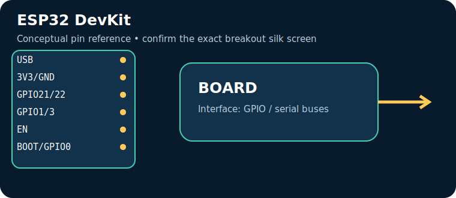
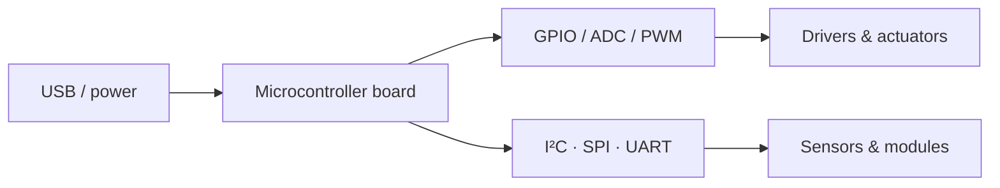

# ESP32 DevKit

> **Role:** wireless IoT and higher processing. Typical Indian retail range: **₹350–900** (indicative on 17 July 2026, not a live quote).

| Property | Reference |
|---|---|
| Controller | ESP32 dual-core Wi‑Fi/BLE, 3.3 V |
| I/O summary | GPIO varies; ADC, DAC (some), I²C, SPI, UART, PWM |
| Logic level | Check the board documentation; many pins are 3.3 V-only |
| Alternative | ESP8266 / Raspberry Pi Pico W |

## Reference pinout — key pins and connectors

> These labels and functions are for the named reference board revision. Header position and alternate functions must be checked against the official board pinout linked below; do not transfer Arduino-style labels between different board families.

| Pin / connector | Use |
|---|---|
| `USB` | power/programming |
| `3V3/GND` | logic rail |
| `GPIO21/22` | common I²C |
| `GPIO1/3` | UART0 |
| `EN` | reset |
| `BOOT/GPIO0` | flash mode |

## Applications, technique and selection

The board executes firmware stored in its controller and uses digital/analog peripherals to sample sensors and drive outputs. Choose it for **wireless IoT and higher processing**: its processor, voltage domain, memory, connectivity and physical size determine whether it fits. Typical applications include data loggers, control panels, robotics and connected sensor nodes.

## Three first programs, output and inference

1. [Blink / GPIO smoke test](../PROGRAM_COOKBOOK.md#blink-gpio-smoke-test): LED changes every second — proves upload, clock and output pin.
2. [I²C scanner](../PROGRAM_COOKBOOK.md#i2c-scanner): serial output lists responding addresses — proves shared-bus wiring.
3. [Filtered telemetry and alarm](../PROGRAM_COOKBOOK.md#filtered-telemetry-and-alarm): serial readings and state — proves the acquisition-to-decision loop.

**Inference:** passing these tests does not establish voltage compatibility or sensor accuracy. Confirm common ground, logic levels, current budget and exact pin multiplexing before expansion.

## Comparison and trade-offs

| Board | Best when | Trade-off |
|---|---|---|
| **ESP32 DevKit** | wireless IoT and higher processing | Check its exact variant, USB interface and voltage limits |
| **ESP8266 / Raspberry Pi Pico W** | requirements differ in wireless capability, speed, I/O or power | requires a different toolchain or wiring plan |

**Advantages:** popular tools/tutorials; flexible interfaces; fast iteration.

**Disadvantages:** development boards are not automatically rugged, low-power or electrically protected products; add regulator, protection, enclosure and driver circuitry where needed.

## Verification source

- Official documentation: [docs.espressif.com](https://docs.espressif.com/projects/esp-idf/en/latest/esp32/hw-reference/esp32/user-guide-devkitc.html)
- [Reference policy](../REFERENCE_POLICY.md)
