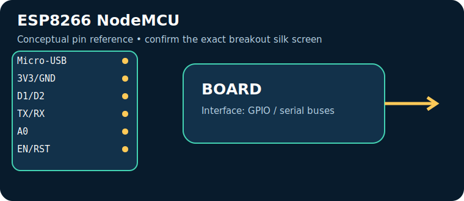
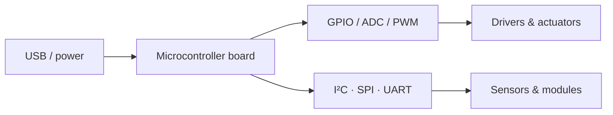

# ESP8266 NodeMCU

> **Role:** low-cost Wi‑Fi sensor node. Typical Indian retail range: **₹250–650** (indicative on 17 July 2026, not a live quote).

| Property | Reference |
|---|---|
| Controller | ESP8266 Wi‑Fi, 3.3 V |
| I/O summary | GPIO limited; one ADC; I²C/SPI/UART by pin mux |
| Logic level | Check the board documentation; many pins are 3.3 V-only |
| Alternative | ESP32 / Pico W |

## Key pins and connectors

| Pin / connector | Use |
|---|---|
| `Micro-USB` | power/programming |
| `3V3/GND` | logic |
| `D1/D2` | common I²C |
| `TX/RX` | UART |
| `A0` | ADC |
| `EN/RST` | control |

## Applications, technique and selection

The board executes firmware stored in its controller and uses digital/analog peripherals to sample sensors and drive outputs. Choose it for **low-cost Wi‑Fi sensor node**: its processor, voltage domain, memory, connectivity and physical size determine whether it fits. Typical applications include data loggers, control panels, robotics and connected sensor nodes.

## Three first programs, output and inference

1. [Blink / GPIO smoke test](../PROGRAM_COOKBOOK.md#blink-gpio-smoke-test): LED changes every second — proves upload, clock and output pin.
2. [I²C scanner](../PROGRAM_COOKBOOK.md#i2c-scanner): serial output lists responding addresses — proves shared-bus wiring.
3. [Filtered telemetry and alarm](../PROGRAM_COOKBOOK.md#filtered-telemetry-and-alarm): serial readings and state — proves the acquisition-to-decision loop.

**Inference:** passing these tests does not establish voltage compatibility or sensor accuracy. Confirm common ground, logic levels, current budget and exact pin multiplexing before expansion.

## Comparison and trade-offs

| Board | Best when | Trade-off |
|---|---|---|
| **ESP8266 NodeMCU** | low-cost Wi‑Fi sensor node | Check its exact variant, USB interface and voltage limits |
| **ESP32 / Pico W** | requirements differ in wireless capability, speed, I/O or power | requires a different toolchain or wiring plan |

**Advantages:** popular tools/tutorials; flexible interfaces; fast iteration.

**Disadvantages:** development boards are not automatically rugged, low-power or electrically protected products; add regulator, protection, enclosure and driver circuitry where needed.

## Verification source

- Official documentation: [arduino-esp8266.readthedocs.io](https://arduino-esp8266.readthedocs.io/en/latest/boards.html)
- [Reference policy](../REFERENCE_POLICY.md)
