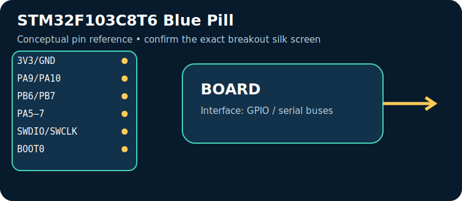
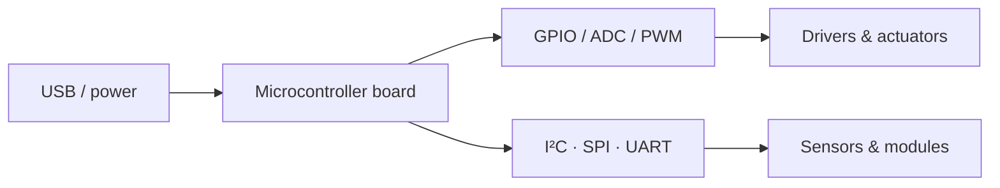

# STM32F103C8T6 Blue Pill

> **Role:** low-cost ARM bare-metal learning. Typical Indian retail range: **₹250–650** (indicative on 17 July 2026, not a live quote).

| Property | Reference |
|---|---|
| Controller | STM32F103C8T6 Cortex‑M3, 3.3 V |
| I/O summary | GPIO with ADC, timers, I²C, SPI, UART, CAN |
| Logic level | Check the board documentation; many pins are 3.3 V-only |
| Alternative | Pico / Nucleo |

## Reference pinout — key pins and connectors

> These labels and functions are for the named reference board revision. Header position and alternate functions must be checked against the official board pinout linked below; do not transfer Arduino-style labels between different board families.

| Pin / connector | Use |
|---|---|
| `3V3/GND` | logic |
| `PA9/PA10` | UART1 |
| `PB6/PB7` | I²C1 remap |
| `PA5–7` | SPI1 |
| `SWDIO/SWCLK` | debug |
| `BOOT0` | boot select |

## Applications, technique and selection

The board executes firmware stored in its controller and uses digital/analog peripherals to sample sensors and drive outputs. Choose it for **low-cost ARM bare-metal learning**: its processor, voltage domain, memory, connectivity and physical size determine whether it fits. Typical applications include data loggers, control panels, robotics and connected sensor nodes.

## Three first programs, output and inference

1. [Blink / GPIO smoke test](../PROGRAM_COOKBOOK.md#blink-gpio-smoke-test): LED changes every second — proves upload, clock and output pin.
2. [I²C scanner](../PROGRAM_COOKBOOK.md#i2c-scanner): serial output lists responding addresses — proves shared-bus wiring.
3. [Filtered telemetry and alarm](../PROGRAM_COOKBOOK.md#filtered-telemetry-and-alarm): serial readings and state — proves the acquisition-to-decision loop.

**Inference:** passing these tests does not establish voltage compatibility or sensor accuracy. Confirm common ground, logic levels, current budget and exact pin multiplexing before expansion.

## Comparison and trade-offs

| Board | Best when | Trade-off |
|---|---|---|
| **STM32F103C8T6 Blue Pill** | low-cost ARM bare-metal learning | Check its exact variant, USB interface and voltage limits |
| **Pico / Nucleo** | requirements differ in wireless capability, speed, I/O or power | requires a different toolchain or wiring plan |

**Advantages:** popular tools/tutorials; flexible interfaces; fast iteration.

**Disadvantages:** development boards are not automatically rugged, low-power or electrically protected products; add regulator, protection, enclosure and driver circuitry where needed.

## Verification source

- Official documentation: [www.st.com](https://www.st.com/en/microcontrollers-microprocessors/stm32f103c8.html)
- [Reference policy](../REFERENCE_POLICY.md)
