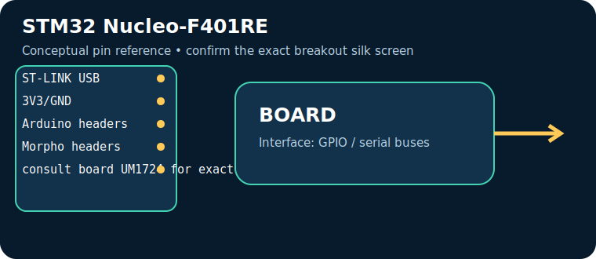
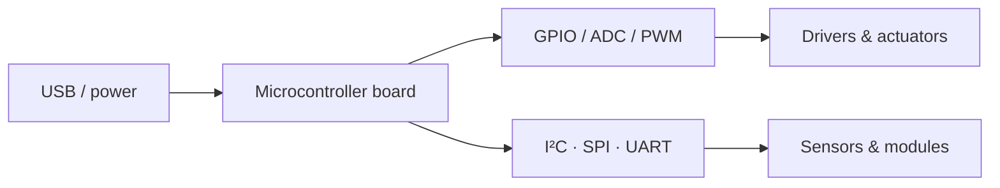

# STM32 Nucleo-F401RE

> **Role:** professional STM32 learning with onboard debugger. Typical Indian retail range: **₹1,600–3,500** (indicative on 17 July 2026, not a live quote).

| Property | Reference |
|---|---|
| Controller | STM32F401RE Cortex-M4, 84 MHz, 3.3 V |
| I/O summary | Arduino Uno R3 headers plus ST Morpho headers, ADC/timers/UART/I²C/SPI |
| Logic level | Check the board documentation; many pins are 3.3 V-only |
| Alternative | Blue Pill / Raspberry Pi Pico |

## Reference pinout — key pins and connectors

> These labels and functions are for the named reference board revision. Header position and alternate functions must be checked against the official board pinout linked below; do not transfer Arduino-style labels between different board families.

| Pin / connector | Use |
|---|---|
| `ST-LINK USB` | power/debug/programming |
| `3V3/GND` | logic |
| `Arduino headers` | shield compatibility |
| `Morpho headers` | full MCU access |
| `consult board UM1724 for exact header mapping` | See board documentation |

## Applications, technique and selection

The board executes firmware stored in its controller and uses digital/analog peripherals to sample sensors and drive outputs. Choose it for **professional STM32 learning with onboard debugger**: its processor, voltage domain, memory, connectivity and physical size determine whether it fits. Typical applications include data loggers, control panels, robotics and connected sensor nodes.

## Three first programs, output and inference

1. [Blink / GPIO smoke test](../PROGRAM_COOKBOOK.md#blink-gpio-smoke-test): LED changes every second — proves upload, clock and output pin.
2. [I²C scanner](../PROGRAM_COOKBOOK.md#i2c-scanner): serial output lists responding addresses — proves shared-bus wiring.
3. [Filtered telemetry and alarm](../PROGRAM_COOKBOOK.md#filtered-telemetry-and-alarm): serial readings and state — proves the acquisition-to-decision loop.

**Inference:** passing these tests does not establish voltage compatibility or sensor accuracy. Confirm common ground, logic levels, current budget and exact pin multiplexing before expansion.

## Comparison and trade-offs

| Board | Best when | Trade-off |
|---|---|---|
| **STM32 Nucleo-F401RE** | professional STM32 learning with onboard debugger | Check its exact variant, USB interface and voltage limits |
| **Blue Pill / Raspberry Pi Pico** | requirements differ in wireless capability, speed, I/O or power | requires a different toolchain or wiring plan |

**Advantages:** popular tools/tutorials; flexible interfaces; fast iteration.

**Disadvantages:** development boards are not automatically rugged, low-power or electrically protected products; add regulator, protection, enclosure and driver circuitry where needed.

## Verification source

- Official documentation: [www.st.com](https://www.st.com/en/evaluation-tools/nucleo-f401re.html)
- [Reference policy](../REFERENCE_POLICY.md)
