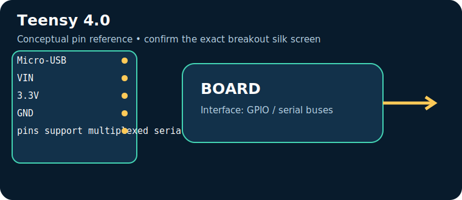
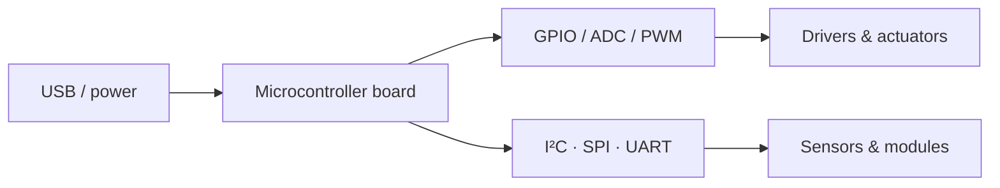

# Teensy 4.0

> **Role:** high-performance audio/control. Typical Indian retail range: **₹3,000–5,500** (indicative on 17 July 2026, not a live quote).

| Property | Reference |
|---|---|
| Controller | i.MX RT1062 Cortex‑M7, 600 MHz, 3.3 V |
| I/O summary | many GPIO; ADC, I²C, SPI, UART, I²S, USB |
| Logic level | Check the board documentation; many pins are 3.3 V-only |
| Alternative | ESP32-S3 / STM32 |

## Key pins and connectors

| Pin / connector | Use |
|---|---|
| `Micro-USB` | programming/USB |
| `VIN` | 5 V input |
| `3.3V` | rail |
| `GND` | return |
| `pins support multiplexed serial/audio functions` | See board documentation |

## Applications, technique and selection

The board executes firmware stored in its controller and uses digital/analog peripherals to sample sensors and drive outputs. Choose it for **high-performance audio/control**: its processor, voltage domain, memory, connectivity and physical size determine whether it fits. Typical applications include data loggers, control panels, robotics and connected sensor nodes.

## Three first programs, output and inference

1. [Blink / GPIO smoke test](../PROGRAM_COOKBOOK.md#blink-gpio-smoke-test): LED changes every second — proves upload, clock and output pin.
2. [I²C scanner](../PROGRAM_COOKBOOK.md#i2c-scanner): serial output lists responding addresses — proves shared-bus wiring.
3. [Filtered telemetry and alarm](../PROGRAM_COOKBOOK.md#filtered-telemetry-and-alarm): serial readings and state — proves the acquisition-to-decision loop.

**Inference:** passing these tests does not establish voltage compatibility or sensor accuracy. Confirm common ground, logic levels, current budget and exact pin multiplexing before expansion.

## Comparison and trade-offs

| Board | Best when | Trade-off |
|---|---|---|
| **Teensy 4.0** | high-performance audio/control | Check its exact variant, USB interface and voltage limits |
| **ESP32-S3 / STM32** | requirements differ in wireless capability, speed, I/O or power | requires a different toolchain or wiring plan |

**Advantages:** popular tools/tutorials; flexible interfaces; fast iteration.

**Disadvantages:** development boards are not automatically rugged, low-power or electrically protected products; add regulator, protection, enclosure and driver circuitry where needed.

## Verification source

- Official documentation: [www.pjrc.com](https://www.pjrc.com/store/teensy40.html)
- [Reference policy](../REFERENCE_POLICY.md)
