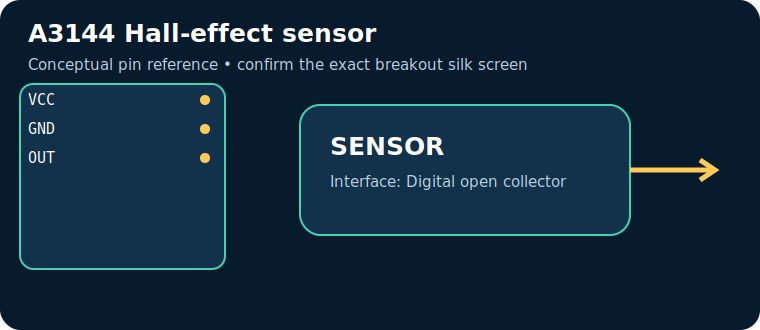
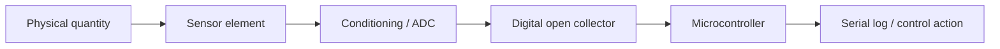

# A3144 Hall-effect sensor

> **Quick decision:** choose this for **contactless magnet detection**. It communicates over **Digital open collector** and typical Indian retail pricing is **₹40–120** (indicative, checked catalogue range on 17 July 2026; shipping, clones, probe and tax can change it).

## At a glance

| Property | Reference value |
|---|---|
| Common module interface | Digital open collector |
| Supply | 4.5–24 V |
| Typical price in India | ₹40–120 |
| Same-job alternative | Reed switch / AS5600 |
| Primary technique | Hall effect magnetic field threshold switch |

## Pins — common breakout/module

> Pin order is **not universal**. Read the labels on the actual board and its datasheet before energising it.

| Pin | Use |
|---|---|
| `VCC` | power |
| `GND` | return |
| `OUT` | open-collector output, add pull-up |

## How it works

Hall effect magnetic field threshold switch. The module conditions or digitises that physical effect, then exposes it through Digital open collector. Treat raw readings as measurements requiring the stated calibration, warm-up, mounting and environmental controls.

## Where and why to use it

**Useful for:** RPM counter, endstop, wheel speed. It is a practical choice when contactless magnet detection; it is not a substitute for a safety-, medical-, or revenue-grade instrument unless the complete product is designed, calibrated and certified for that purpose.

## Two program paths, output and inference

Use the matching, complete sketches in the [program cookbook](../PROGRAM_COOKBOOK.md). They are intentionally small enough to adapt before integrating a library.

1. **Path A — interface bring-up:** use [the Digital open collector recipe](../PROGRAM_COOKBOOK.md#digital-threshold). Confirm the bus/pulse/ADC data first.
2. **Path B — application loop:** use [the filtered alarm/logger recipe](../PROGRAM_COOKBOOK.md#filtered-telemetry-and-alarm). Replace `readSensor()` with the Path A acquisition and set thresholds only after calibration.

**Expected output:** a timestamped raw or converted reading in Serial Monitor; the alarm recipe reports `NORMAL` or `CHECK`.

**Inference:** a changing, plausible reading proves communication, **not accuracy**. Compare against a known reference, observe noise/range, and record offsets before making an automated decision.

## Comparison

| Choice | Prefer it when | Trade-off |
|---|---|---|
| **A3144 Hall-effect sensor** | contactless magnet detection | Verify calibration, operating range and module variant |
| **Reed switch / AS5600** | you need a different accuracy, range, lifetime or interface | normally costs more or needs more integration |

## Advantages and limitations

**Advantages**
- Accessible module ecosystem and microcontroller support.
- Directly useful for RPM counter, endstop, wheel speed.
- Digital open collector can be logged or acted on by a small controller.

**Limitations / precautions**
- Module pin labels, regulator and logic levels vary by seller; never assume 5 V tolerance.
- Results depend on placement, interference, warm-up and calibration.
- Do not use a hobby module alone for life safety, fire, gas safety, medical diagnosis or legal metering.

## Verification source

- Primary product/datasheet page: [www.allegromicro.com](https://www.allegromicro.com/en/products/sense/switches-and-latches/a3141-2-3-4)
- Catalogue policy, wiring conventions and price scope: [Reference policy](../REFERENCE_POLICY.md)
