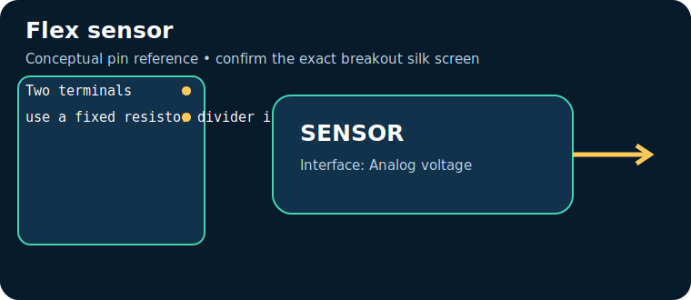

# Flex sensor

> **Quick decision:** choose this for **bend-angle proxy after per-device calibration**. It communicates over **Analog voltage** and typical Indian retail pricing is **₹500–1,200** (indicative, checked catalogue range on 17 July 2026; shipping, clones, probe and tax can change it).

## At a glance

| Property | Reference value |
|---|---|
| Common module interface | Analog voltage |
| Supply | 3.3–5 V divider |
| Typical price in India | ₹500–1,200 |
| Same-job alternative | IMU / rotary encoder |
| Primary technique | Conductive ink resistance changes when bent |

## Reference pinout — labels and functions

> The table uses the signal labels for the reference device/module linked below. Those signal names and functions are exact for that reference; clone breakouts can rearrange physical header order, add regulators, or rename labels. Match the actual silk screen to the linked pinout/datasheet before powering it.

| Pin | Use |
|---|---|
| `Two terminals` | variable resistor |
| `use a fixed resistor divider into ADC` | See module documentation |

## How it works

Conductive ink resistance changes when bent. The module conditions or digitises that physical effect, then exposes it through Analog voltage. Treat raw readings as measurements requiring the stated calibration, warm-up, mounting and environmental controls.

## Where and why to use it

**Useful for:** data glove, posture demo, soft robot. It is a practical choice when bend-angle proxy after per-device calibration; it is not a substitute for a safety-, medical-, or revenue-grade instrument unless the complete product is designed, calibrated and certified for that purpose.

## Two program paths, output and inference

Use the matching, complete sketches in the [program cookbook](../PROGRAM_COOKBOOK.md). They are intentionally small enough to adapt before integrating a library.

1. **Path A — interface bring-up:** use [the Analog voltage recipe](../PROGRAM_COOKBOOK.md#analog-voltage). Confirm the bus/pulse/ADC data first.
2. **Path B — application loop:** use [the filtered alarm/logger recipe](../PROGRAM_COOKBOOK.md#filtered-telemetry-and-alarm). Replace `readSensor()` with the Path A acquisition and set thresholds only after calibration.

**Expected output:** a timestamped raw or converted reading in Serial Monitor; the alarm recipe reports `NORMAL` or `CHECK`.

**Inference:** a changing, plausible reading proves communication, **not accuracy**. Compare against a known reference, observe noise/range, and record offsets before making an automated decision.

## Comparison

| Choice | Prefer it when | Trade-off |
|---|---|---|
| **Flex sensor** | bend-angle proxy after per-device calibration | Verify calibration, operating range and module variant |
| **IMU / rotary encoder** | you need a different accuracy, range, lifetime or interface | normally costs more or needs more integration |

## Advantages and limitations

**Advantages**
- Accessible module ecosystem and microcontroller support.
- Directly useful for data glove, posture demo, soft robot.
- Analog voltage can be logged or acted on by a small controller.

**Limitations / precautions**
- Module pin labels, regulator and logic levels vary by seller; never assume 5 V tolerance.
- Results depend on placement, interference, warm-up and calibration.
- Do not use a hobby module alone for life safety, fire, gas safety, medical diagnosis or legal metering.

## Verification source

- Primary product/datasheet page: [www.spectrasymbol.com](https://www.spectrasymbol.com/flex-sensor)
- Catalogue policy, wiring conventions and price scope: [Reference policy](../REFERENCE_POLICY.md)
