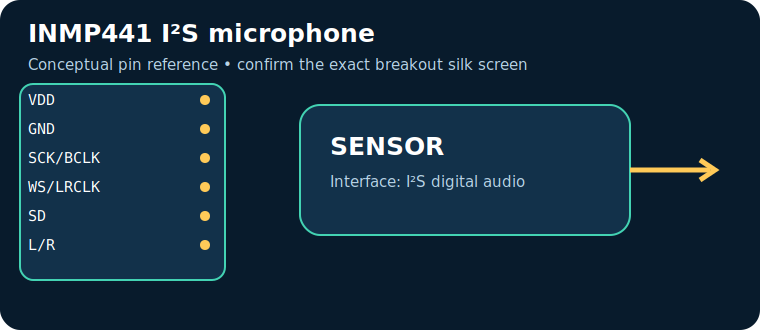

# INMP441 I²S microphone

> **Quick decision:** choose this for **digital audio capture with known sample format**. It communicates over **I²S digital audio** and typical Indian retail pricing is **₹250–650** (indicative, checked catalogue range on 17 July 2026; shipping, clones, probe and tax can change it).

## At a glance

| Property | Reference value |
|---|---|
| Common module interface | I²S digital audio |
| Supply | 1.62–3.63 V |
| Typical price in India | ₹250–650 |
| Same-job alternative | MAX9814 / PDM microphone |
| Primary technique | MEMS capacitive microphone with sigma-delta ADC |

## Pins — common breakout/module

> Pin order is **not universal**. Read the labels on the actual board and its datasheet before energising it.

| Pin | Use |
|---|---|
| `VDD` | 3.3 V |
| `GND` | return |
| `SCK/BCLK` | bit clock |
| `WS/LRCLK` | word select |
| `SD` | audio data |
| `L/R` | channel select |

## How it works

MEMS capacitive microphone with sigma-delta ADC. The module conditions or digitises that physical effect, then exposes it through I²S digital audio. Treat raw readings as measurements requiring the stated calibration, warm-up, mounting and environmental controls.

## Where and why to use it

**Useful for:** voice activity, audio logger, FFT visualizer. It is a practical choice when digital audio capture with known sample format; it is not a substitute for a safety-, medical-, or revenue-grade instrument unless the complete product is designed, calibrated and certified for that purpose.

## Two program paths, output and inference

Use the matching, complete sketches in the [program cookbook](../PROGRAM_COOKBOOK.md). They are intentionally small enough to adapt before integrating a library.

1. **Path A — interface bring-up:** use [the I²S digital audio recipe](../PROGRAM_COOKBOOK.md#i2s-digital-audio). Confirm the bus/pulse/ADC data first.
2. **Path B — application loop:** use [the filtered alarm/logger recipe](../PROGRAM_COOKBOOK.md#filtered-telemetry-and-alarm). Replace `readSensor()` with the Path A acquisition and set thresholds only after calibration.

**Expected output:** a timestamped raw or converted reading in Serial Monitor; the alarm recipe reports `NORMAL` or `CHECK`.

**Inference:** a changing, plausible reading proves communication, **not accuracy**. Compare against a known reference, observe noise/range, and record offsets before making an automated decision.

## Comparison

| Choice | Prefer it when | Trade-off |
|---|---|---|
| **INMP441 I²S microphone** | digital audio capture with known sample format | Verify calibration, operating range and module variant |
| **MAX9814 / PDM microphone** | you need a different accuracy, range, lifetime or interface | normally costs more or needs more integration |

## Advantages and limitations

**Advantages**
- Accessible module ecosystem and microcontroller support.
- Directly useful for voice activity, audio logger, FFT visualizer.
- I²S digital audio can be logged or acted on by a small controller.

**Limitations / precautions**
- Module pin labels, regulator and logic levels vary by seller; never assume 5 V tolerance.
- Results depend on placement, interference, warm-up and calibration.
- Do not use a hobby module alone for life safety, fire, gas safety, medical diagnosis or legal metering.

## Verification source

- Primary product/datasheet page: [invensense.tdk.com](https://invensense.tdk.com/products/digital/inmp441/)
- Catalogue policy, wiring conventions and price scope: [Reference policy](../REFERENCE_POLICY.md)
