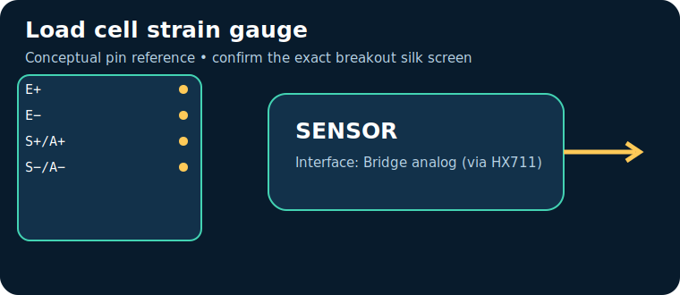

# Load cell strain gauge



> **Quick decision:** choose this for **force or mass with stable mechanics and calibration**. It communicates over **Bridge analog (via HX711)** and typical Indian retail pricing is **₹300–1,500** (indicative, checked catalogue range on 17 July 2026; shipping, clones, probe and tax can change it).

## At a glance

| Property | Reference value |
|---|---|
| Common module interface | Bridge analog (via HX711) |
| Supply | typically 5–10 V excitation |
| Typical price in India | ₹300–1,500 |
| Same-job alternative | FSR / pressure sensor |
| Primary technique | Metal-foil strain gauges change resistance under deformation |

## Pins — common breakout/module

> Pin order is **not universal**. Read the labels on the actual board and its datasheet before energising it.

| Pin | Use |
|---|---|
| `E+` | bridge excitation + |
| `E−` | excitation − |
| `S+/A+` | signal + |
| `S−/A−` | signal − |

## How it works

Metal-foil strain gauges change resistance under deformation. The module conditions or digitises that physical effect, then exposes it through Bridge analog (via HX711). Treat raw readings as measurements requiring the stated calibration, warm-up, mounting and environmental controls.

```mermaid
flowchart LR
  P[Physical quantity] --> E[Sensor element]
  E --> C[Conditioning / ADC]
  C --> I[Bridge analog (via HX711)]
  I --> M[Microcontroller]
  M --> O[Serial log / control action]
```

## Where and why to use it

**Useful for:** weighing scale, material test rig. It is a practical choice when force or mass with stable mechanics and calibration; it is not a substitute for a safety-, medical-, or revenue-grade instrument unless the complete product is designed, calibrated and certified for that purpose.

## Two program paths, output and inference

Use the matching, complete sketches in the [program cookbook](../PROGRAM_COOKBOOK.md). They are intentionally small enough to adapt before integrating a library.

1. **Path A — interface bring-up:** use [the Bridge analog (via HX711) recipe](../PROGRAM_COOKBOOK.md#analog-voltage). Confirm the bus/pulse/ADC data first.
2. **Path B — application loop:** use [the filtered alarm/logger recipe](../PROGRAM_COOKBOOK.md#filtered-telemetry-and-alarm). Replace `readSensor()` with the Path A acquisition and set thresholds only after calibration.

**Expected output:** a timestamped raw or converted reading in Serial Monitor; the alarm recipe reports `NORMAL` or `CHECK`.

**Inference:** a changing, plausible reading proves communication, **not accuracy**. Compare against a known reference, observe noise/range, and record offsets before making an automated decision.

## Comparison

| Choice | Prefer it when | Trade-off |
|---|---|---|
| **Load cell strain gauge** | force or mass with stable mechanics and calibration | Verify calibration, operating range and module variant |
| **FSR / pressure sensor** | you need a different accuracy, range, lifetime or interface | normally costs more or needs more integration |

## Advantages and limitations

**Advantages**
- Accessible module ecosystem and microcontroller support.
- Directly useful for weighing scale, material test rig.
- Bridge analog (via HX711) can be logged or acted on by a small controller.

**Limitations / precautions**
- Module pin labels, regulator and logic levels vary by seller; never assume 5 V tolerance.
- Results depend on placement, interference, warm-up and calibration.
- Do not use a hobby module alone for life safety, fire, gas safety, medical diagnosis or legal metering.

## Verification source

- Primary product/datasheet page: [www.omega.com](https://www.omega.com/en-us/resources/load-cells)
- Catalogue policy, wiring conventions and price scope: [Reference policy](../REFERENCE_POLICY.md)
