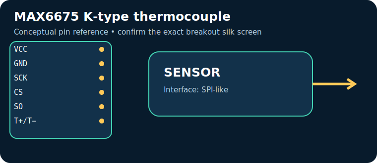
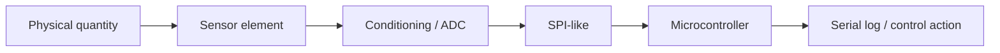

# MAX6675 K-type thermocouple

> **Quick decision:** choose this for **high-temperature K-type measurement**. It communicates over **SPI-like** and typical Indian retail pricing is **₹250–650** (indicative, checked catalogue range on 17 July 2026; shipping, clones, probe and tax can change it).

## At a glance

| Property | Reference value |
|---|---|
| Common module interface | SPI-like |
| Supply | 3.0–5.5 V |
| Typical price in India | ₹250–650 |
| Same-job alternative | MAX31855 / PT100 interface |
| Primary technique | Cold-junction-compensated thermocouple-to-digital conversion |

## Pins — common breakout/module

> Pin order is **not universal**. Read the labels on the actual board and its datasheet before energising it.

| Pin | Use |
|---|---|
| `VCC` | power |
| `GND` | return |
| `SCK` | clock |
| `CS` | chip select |
| `SO` | data to MCU |
| `T+/T−` | thermocouple |

## How it works

Cold-junction-compensated thermocouple-to-digital conversion. The module conditions or digitises that physical effect, then exposes it through SPI-like. Treat raw readings as measurements requiring the stated calibration, warm-up, mounting and environmental controls.

## Where and why to use it

**Useful for:** kiln monitor, exhaust experiment, reflow oven. It is a practical choice when high-temperature K-type measurement; it is not a substitute for a safety-, medical-, or revenue-grade instrument unless the complete product is designed, calibrated and certified for that purpose.

## Two program paths, output and inference

Use the matching, complete sketches in the [program cookbook](../PROGRAM_COOKBOOK.md). They are intentionally small enough to adapt before integrating a library.

1. **Path A — interface bring-up:** use [the SPI-like recipe](../PROGRAM_COOKBOOK.md#spi). Confirm the bus/pulse/ADC data first.
2. **Path B — application loop:** use [the filtered alarm/logger recipe](../PROGRAM_COOKBOOK.md#filtered-telemetry-and-alarm). Replace `readSensor()` with the Path A acquisition and set thresholds only after calibration.

**Expected output:** a timestamped raw or converted reading in Serial Monitor; the alarm recipe reports `NORMAL` or `CHECK`.

**Inference:** a changing, plausible reading proves communication, **not accuracy**. Compare against a known reference, observe noise/range, and record offsets before making an automated decision.

## Comparison

| Choice | Prefer it when | Trade-off |
|---|---|---|
| **MAX6675 K-type thermocouple** | high-temperature K-type measurement | Verify calibration, operating range and module variant |
| **MAX31855 / PT100 interface** | you need a different accuracy, range, lifetime or interface | normally costs more or needs more integration |

## Advantages and limitations

**Advantages**
- Accessible module ecosystem and microcontroller support.
- Directly useful for kiln monitor, exhaust experiment, reflow oven.
- SPI-like can be logged or acted on by a small controller.

**Limitations / precautions**
- Module pin labels, regulator and logic levels vary by seller; never assume 5 V tolerance.
- Results depend on placement, interference, warm-up and calibration.
- Do not use a hobby module alone for life safety, fire, gas safety, medical diagnosis or legal metering.

## Verification source

- Primary product/datasheet page: [www.analog.com](https://www.analog.com/en/products/max6675.html)
- Catalogue policy, wiring conventions and price scope: [Reference policy](../REFERENCE_POLICY.md)
