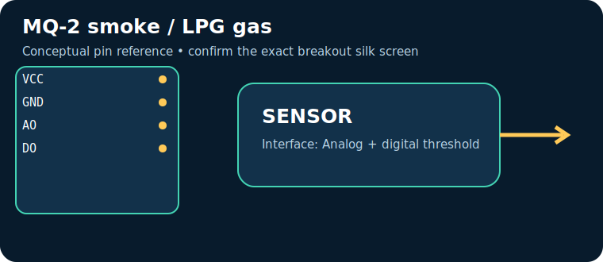

# MQ-2 smoke / LPG gas

> **Quick decision:** choose this for **low-cost combustible-gas alarm experiments**. It communicates over **Analog + digital threshold** and typical Indian retail pricing is **₹90–180** (indicative, checked catalogue range on 17 July 2026; shipping, clones, probe and tax can change it).

## At a glance

| Property | Reference value |
|---|---|
| Common module interface | Analog + digital threshold |
| Supply | 5 V (heater) |
| Typical price in India | ₹90–180 |
| Same-job alternative | MQ-135 / electrochemical gas sensor |
| Primary technique | Heated SnO₂ chemiresistor changes resistance in reducing gases |

## Pins — common breakout/module

> Pin order is **not universal**. Read the labels on the actual board and its datasheet before energising it.

| Pin | Use |
|---|---|
| `VCC` | 5 V heater |
| `GND` | return |
| `AO` | analog concentration proxy |
| `DO` | comparator alarm |

## How it works

Heated SnO₂ chemiresistor changes resistance in reducing gases. The module conditions or digitises that physical effect, then exposes it through Analog + digital threshold. Treat raw readings as measurements requiring the stated calibration, warm-up, mounting and environmental controls.

## Where and why to use it

**Useful for:** smoke alarm demonstrator, LPG leak alert. It is a practical choice when low-cost combustible-gas alarm experiments; it is not a substitute for a safety-, medical-, or revenue-grade instrument unless the complete product is designed, calibrated and certified for that purpose.

## Two program paths, output and inference

Use the matching, complete sketches in the [program cookbook](../PROGRAM_COOKBOOK.md). They are intentionally small enough to adapt before integrating a library.

1. **Path A — interface bring-up:** use [the Analog + digital threshold recipe](../PROGRAM_COOKBOOK.md#analog-voltage). Confirm the bus/pulse/ADC data first.
2. **Path B — application loop:** use [the filtered alarm/logger recipe](../PROGRAM_COOKBOOK.md#filtered-telemetry-and-alarm). Replace `readSensor()` with the Path A acquisition and set thresholds only after calibration.

**Expected output:** a timestamped raw or converted reading in Serial Monitor; the alarm recipe reports `NORMAL` or `CHECK`.

**Inference:** a changing, plausible reading proves communication, **not accuracy**. Compare against a known reference, observe noise/range, and record offsets before making an automated decision.

## Comparison

| Choice | Prefer it when | Trade-off |
|---|---|---|
| **MQ-2 smoke / LPG gas** | low-cost combustible-gas alarm experiments | Verify calibration, operating range and module variant |
| **MQ-135 / electrochemical gas sensor** | you need a different accuracy, range, lifetime or interface | normally costs more or needs more integration |

## Advantages and limitations

**Advantages**
- Accessible module ecosystem and microcontroller support.
- Directly useful for smoke alarm demonstrator, LPG leak alert.
- Analog + digital threshold can be logged or acted on by a small controller.

**Limitations / precautions**
- Module pin labels, regulator and logic levels vary by seller; never assume 5 V tolerance.
- Results depend on placement, interference, warm-up and calibration.
- Do not use a hobby module alone for life safety, fire, gas safety, medical diagnosis or legal metering.

## Verification source

- Primary product/datasheet page: [www.winsen-sensor.com](https://www.winsen-sensor.com/product/mq-2.html)
- Catalogue policy, wiring conventions and price scope: [Reference policy](../REFERENCE_POLICY.md)
