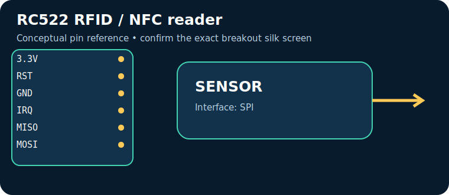

# RC522 RFID / NFC reader

> **Quick decision:** choose this for **low-cost local tag identification**. It communicates over **SPI** and typical Indian retail pricing is **₹120–300** (indicative, checked catalogue range on 17 July 2026; shipping, clones, probe and tax can change it).

## At a glance

| Property | Reference value |
|---|---|
| Common module interface | SPI |
| Supply | 2.5–3.3 V |
| Typical price in India | ₹120–300 |
| Same-job alternative | PN532 / QR scanner |
| Primary technique | 13.56 MHz inductive coupling reads ISO/IEC 14443A-compatible tags |

## Reference pinout — labels and functions

> The table uses the signal labels for the reference device/module linked below. Those signal names and functions are exact for that reference; clone breakouts can rearrange physical header order, add regulators, or rename labels. Match the actual silk screen to the linked pinout/datasheet before powering it.

| Pin | Use |
|---|---|
| `3.3V` | power only |
| `RST` | reset |
| `GND` | return |
| `IRQ` | interrupt |
| `MISO` | SPI data to MCU |
| `MOSI` | SPI data from MCU |
| `SCK` | SPI clock |
| `SDA/SS` | chip select |

## How it works

13.56 MHz inductive coupling reads ISO/IEC 14443A-compatible tags. The module conditions or digitises that physical effect, then exposes it through SPI. Treat raw readings as measurements requiring the stated calibration, warm-up, mounting and environmental controls.

## Where and why to use it

**Useful for:** access-control demo, attendance logger, inventory prototype. It is a practical choice when low-cost local tag identification; it is not a substitute for a safety-, medical-, or revenue-grade instrument unless the complete product is designed, calibrated and certified for that purpose.

## Two program paths, output and inference

Use the matching, complete sketches in the [program cookbook](../PROGRAM_COOKBOOK.md). They are intentionally small enough to adapt before integrating a library.

1. **Path A — interface bring-up:** use [the SPI recipe](../PROGRAM_COOKBOOK.md#spi). Confirm the bus/pulse/ADC data first.
2. **Path B — application loop:** use [the filtered alarm/logger recipe](../PROGRAM_COOKBOOK.md#filtered-telemetry-and-alarm). Replace `readSensor()` with the Path A acquisition and set thresholds only after calibration.

**Expected output:** a timestamped raw or converted reading in Serial Monitor; the alarm recipe reports `NORMAL` or `CHECK`.

**Inference:** a changing, plausible reading proves communication, **not accuracy**. Compare against a known reference, observe noise/range, and record offsets before making an automated decision.

## Comparison

| Choice | Prefer it when | Trade-off |
|---|---|---|
| **RC522 RFID / NFC reader** | low-cost local tag identification | Verify calibration, operating range and module variant |
| **PN532 / QR scanner** | you need a different accuracy, range, lifetime or interface | normally costs more or needs more integration |

## Advantages and limitations

**Advantages**
- Accessible module ecosystem and microcontroller support.
- Directly useful for access-control demo, attendance logger, inventory prototype.
- SPI can be logged or acted on by a small controller.

**Limitations / precautions**
- Module pin labels, regulator and logic levels vary by seller; never assume 5 V tolerance.
- Results depend on placement, interference, warm-up and calibration.
- Do not use a hobby module alone for life safety, fire, gas safety, medical diagnosis or legal metering.

## Verification source

- Primary product/datasheet page: [www.nxp.com](https://www.nxp.com/products/rfid-nfc/mifare-hf/mifare-readers/mfrc522-standard-performance-mifare-and-ntag-frontend:MFRC52202HN1)
- Catalogue policy, wiring conventions and price scope: [Reference policy](../REFERENCE_POLICY.md)
