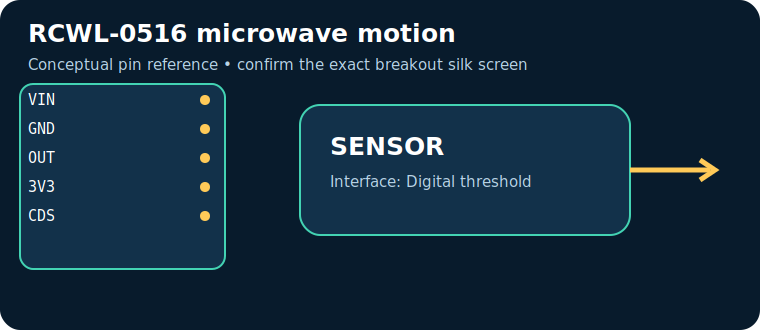

# RCWL-0516 microwave motion

> **Quick decision:** choose this for **motion detection through some non-metallic covers**. It communicates over **Digital threshold** and typical Indian retail pricing is **₹70–180** (indicative, checked catalogue range on 17 July 2026; shipping, clones, probe and tax can change it).

## At a glance

| Property | Reference value |
|---|---|
| Common module interface | Digital threshold |
| Supply | 4–28 V |
| Typical price in India | ₹70–180 |
| Same-job alternative | PIR / mmWave presence |
| Primary technique | Microwave Doppler radar detects motion |

## Pins — common breakout/module

> Pin order is **not universal**. Read the labels on the actual board and its datasheet before energising it.

| Pin | Use |
|---|---|
| `VIN` | power |
| `GND` | return |
| `OUT` | motion logic output |
| `3V3` | regulated output |
| `CDS` | light inhibit |

## How it works

Microwave Doppler radar detects motion. The module conditions or digitises that physical effect, then exposes it through Digital threshold. Treat raw readings as measurements requiring the stated calibration, warm-up, mounting and environmental controls.

## Where and why to use it

**Useful for:** hidden occupancy trigger, automatic door. It is a practical choice when motion detection through some non-metallic covers; it is not a substitute for a safety-, medical-, or revenue-grade instrument unless the complete product is designed, calibrated and certified for that purpose.

## Two program paths, output and inference

Use the matching, complete sketches in the [program cookbook](../PROGRAM_COOKBOOK.md). They are intentionally small enough to adapt before integrating a library.

1. **Path A — interface bring-up:** use [the Digital threshold recipe](../PROGRAM_COOKBOOK.md#digital-threshold). Confirm the bus/pulse/ADC data first.
2. **Path B — application loop:** use [the filtered alarm/logger recipe](../PROGRAM_COOKBOOK.md#filtered-telemetry-and-alarm). Replace `readSensor()` with the Path A acquisition and set thresholds only after calibration.

**Expected output:** a timestamped raw or converted reading in Serial Monitor; the alarm recipe reports `NORMAL` or `CHECK`.

**Inference:** a changing, plausible reading proves communication, **not accuracy**. Compare against a known reference, observe noise/range, and record offsets before making an automated decision.

## Comparison

| Choice | Prefer it when | Trade-off |
|---|---|---|
| **RCWL-0516 microwave motion** | motion detection through some non-metallic covers | Verify calibration, operating range and module variant |
| **PIR / mmWave presence** | you need a different accuracy, range, lifetime or interface | normally costs more or needs more integration |

## Advantages and limitations

**Advantages**
- Accessible module ecosystem and microcontroller support.
- Directly useful for hidden occupancy trigger, automatic door.
- Digital threshold can be logged or acted on by a small controller.

**Limitations / precautions**
- Module pin labels, regulator and logic levels vary by seller; never assume 5 V tolerance.
- Results depend on placement, interference, warm-up and calibration.
- Do not use a hobby module alone for life safety, fire, gas safety, medical diagnosis or legal metering.

## Verification source

- Primary product/datasheet page: [components101.com](https://components101.com/sensors/rcwl-0516-microwave-doppler-radar-sensor)
- Catalogue policy, wiring conventions and price scope: [Reference policy](../REFERENCE_POLICY.md)
