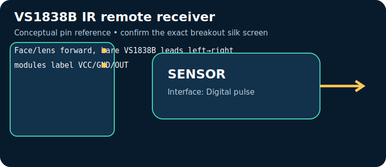

# VS1838B IR remote receiver

> **Quick decision:** choose this for **decode common consumer IR remotes**. It communicates over **Digital pulse** and typical Indian retail pricing is **₹60–160** (indicative, checked catalogue range on 17 July 2026; shipping, clones, probe and tax can change it).

## At a glance

| Property | Reference value |
|---|---|
| Common module interface | Digital pulse |
| Supply | 2.7–5.5 V |
| Typical price in India | ₹60–160 |
| Same-job alternative | TSOP382 / Bluetooth input |
| Primary technique | 38 kHz IR carrier demodulation with AGC and band-pass filtering |

## Reference pinout — labels and functions

> The table uses the signal labels for the reference device/module linked below. Those signal names and functions are exact for that reference; clone breakouts can rearrange physical header order, add regulators, or rename labels. Match the actual silk screen to the linked pinout/datasheet before powering it.

| Pin | Use |
|---|---|
| `Face/lens forward, bare VS1838B leads left→right` | OUT, GND, VCC |
| `modules label VCC/GND/OUT` | See module documentation |

## How it works

38 kHz IR carrier demodulation with AGC and band-pass filtering. The module conditions or digitises that physical effect, then exposes it through Digital pulse. Treat raw readings as measurements requiring the stated calibration, warm-up, mounting and environmental controls.

## Where and why to use it

**Useful for:** TV-remote control, menu input, appliance demo. It is a practical choice when decode common consumer IR remotes; it is not a substitute for a safety-, medical-, or revenue-grade instrument unless the complete product is designed, calibrated and certified for that purpose.

## Two program paths, output and inference

Use the matching, complete sketches in the [program cookbook](../PROGRAM_COOKBOOK.md). They are intentionally small enough to adapt before integrating a library.

1. **Path A — interface bring-up:** use [the Digital pulse recipe](../PROGRAM_COOKBOOK.md#digital-threshold). Confirm the bus/pulse/ADC data first.
2. **Path B — application loop:** use [the filtered alarm/logger recipe](../PROGRAM_COOKBOOK.md#filtered-telemetry-and-alarm). Replace `readSensor()` with the Path A acquisition and set thresholds only after calibration.

**Expected output:** a timestamped raw or converted reading in Serial Monitor; the alarm recipe reports `NORMAL` or `CHECK`.

**Inference:** a changing, plausible reading proves communication, **not accuracy**. Compare against a known reference, observe noise/range, and record offsets before making an automated decision.

## Comparison

| Choice | Prefer it when | Trade-off |
|---|---|---|
| **VS1838B IR remote receiver** | decode common consumer IR remotes | Verify calibration, operating range and module variant |
| **TSOP382 / Bluetooth input** | you need a different accuracy, range, lifetime or interface | normally costs more or needs more integration |

## Advantages and limitations

**Advantages**
- Accessible module ecosystem and microcontroller support.
- Directly useful for TV-remote control, menu input, appliance demo.
- Digital pulse can be logged or acted on by a small controller.

**Limitations / precautions**
- Module pin labels, regulator and logic levels vary by seller; never assume 5 V tolerance.
- Results depend on placement, interference, warm-up and calibration.
- Do not use a hobby module alone for life safety, fire, gas safety, medical diagnosis or legal metering.

## Verification source

- Primary product/datasheet page: [www.vishay.com](https://www.vishay.com/docs/82459/tsop382.pdf)
- Catalogue policy, wiring conventions and price scope: [Reference policy](../REFERENCE_POLICY.md)
